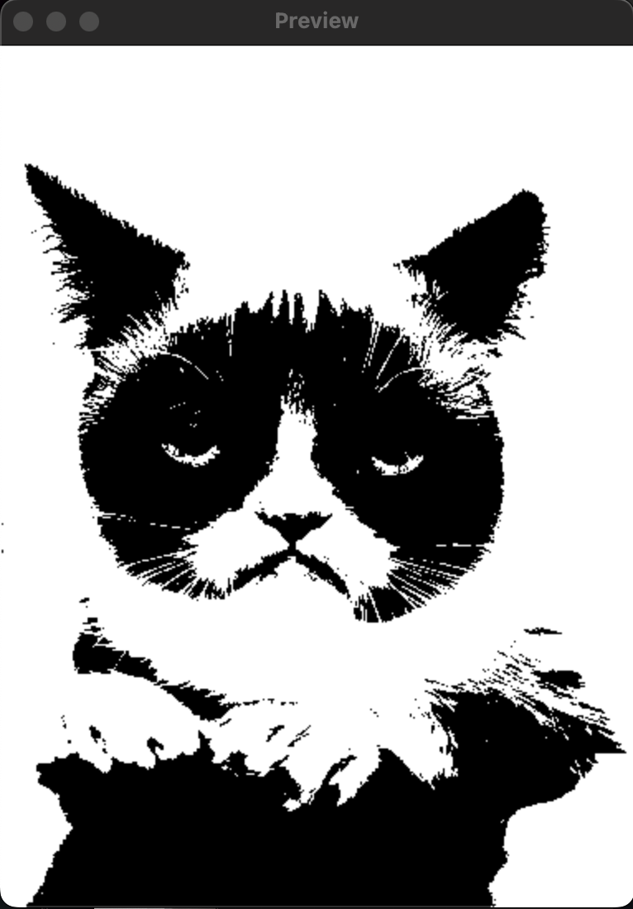
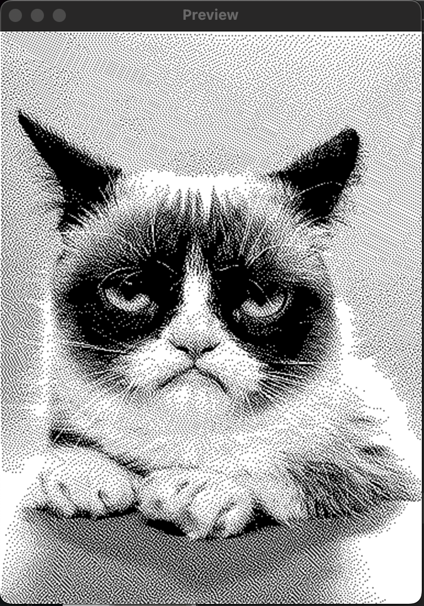

This project allows you to use the MXW01 thermal cat printer with Python. It
provides a command-line interface to print images with various dithering
algorithms and intensity settings.

Discuss in the [#mxw01-hacking](https://hackclub.slack.com/archives/C08MKBC8BE3)
channel on the [Hack Club Slack](https://hackclub.com/slack)!

# Setup

[uv](https://docs.astral.sh/uv/) is reccomended, but you should be able to use
any Python virtual environment you're comfortable with.

```bash
# Make sure you have uv installed
# https://docs.astral.sh/uv/getting-started/installation/

# Clone and navigate to the repo, then run the following commands:

$ uv venv
$ source venv/bin/activate # linux/macOS
$ venv\Scripts\activate # windows
$ uv pip install -r requirements.txt
```

# Usage

```bash
$ ./print.py --help
usage: print.py [-h] [-l {debug,info,warn,error}]
                [-b {mean-threshold,floyd-steinberg,atkinson,halftone,none}]
                [-s] [-d DEVICE] [-i INTENSITY] [--top-first]
                filename

Prints an image on your MXW01 thermal cat printer

positional arguments:
  filename

options:
  -h, --help            show this help message and exit
  -l {debug,info,warn,error}, --log-level {debug,info,warn,error}
  -b {mean-threshold,floyd-steinberg,atkinson,halftone,none}, --dithering-algo
{mean-threshold,floyd-steinberg,atkinson,halftone,none}
                        Which image binarization algorithm to use. If 'none'
                        is used, no binarization will be used. In this case
                        the image has to have a width of 384 px.
  -s, --show-preview    If set, displays the final image and asks the user for
                        confirmation before printing.
  -d DEVICE, --device DEVICE
                        The printer's Bluetooth Low Energy (BLE) address (MAC
                        address on Linux; UUID on macOS) or advertisement name
                        (e.g.: "MXW01"). If omitted, the the script will try
                        to auto discover the printer based on its advertised
                        BLE services.
  -i INTENSITY, --intensity INTENSITY
                        Print intensity/energy byte (0x00-0xFF, default 0x5D).
                        Higher values generally produce darker prints. Accepts
                        hex (0xNN) or decimal.
  --top-first           Print the image top-first. By default, the image is
                        rotated 180 degrees to print right-side-up.
```

# Protocol Documentation

The MXW01's BLE protocol is documented in [PROTOCOL.md](./PROTOCOL.md). This
documentation is a work in progress, please contribute!

# Different Algorithms

This script offers several different dithering algorithms to convert images to
monochrome for printing. The following algorithms are available:

**Mean Threshold:**



**Floyd Steinberg (default):**


**Atkinson:**



**Halftone dithering:**


**None (image must be 384px wide):**


